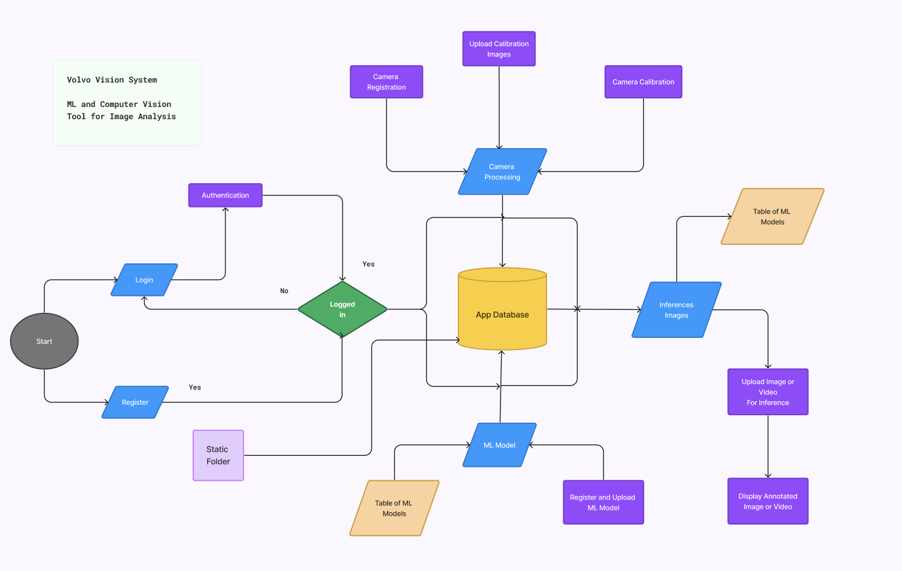
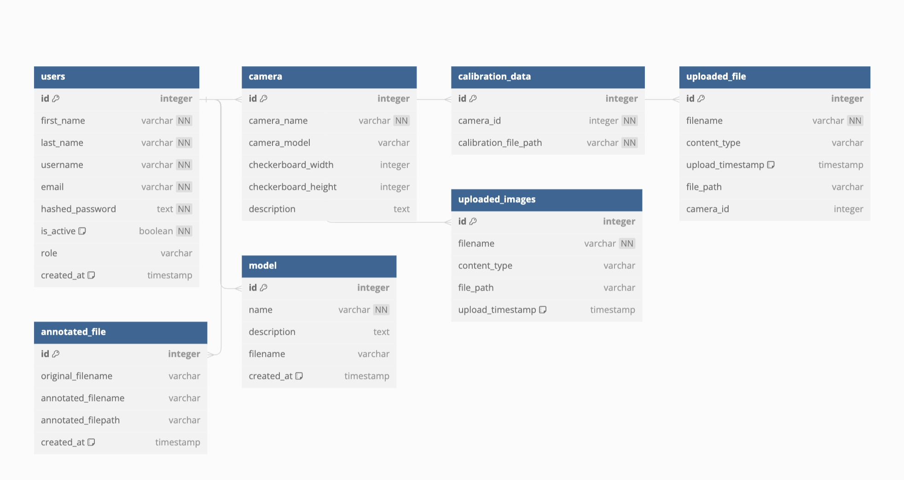

# Capstone Project Summary 

# The Machine Vision System Overview

- The Machine Vision System is poised to redefine the landscape of machine learning (ML) and computer vision technology. 
- This visionary project is focused on developing an advanced engineering tool that extends beyond the capabilities of traditional image and video analysis.

## Key Features

- **Advanced Engineering**: The system facilitates precise camera calibration and distortion correction, which are crucial for high-quality image analysis.

- **Custom ML Models**: It provides the capability to integrate bespoke ML models that are tailored to specific inference tasks, enhancing the accuracy and applicability of the analysis.

- **Model Upload**: Users can upload custom models into the application, which the system uses to deduce inferences and present results for user review and application.

Try it out! ---> [VVS](https://vvs-volvo-application-frontend.onrender.com).

## Project Summary

## Types of Data and Inputs Used

- **Image and Video Feeds**: A wide range of image and video data, serving different analytical purposes.
- **Camera Calibration Data**: Data related to the physical characteristics of the cameras, including lens specifications and positioning.
- **Custom ML Models**: Parameters, training data, and outcomes for bespoke ML models used for tasks like object recognition and pattern detection.

## High-Level Software Design

### Architecture
- Modular architecture with components such as image processing, ML model management, and data storage developed as independent but interconnected modules.

### User Interface (UI)
- An intuitive and interactive interface for both technical and non-technical users, allowing for the seamless upload and analysis of images and videos, and customization of ML models.

[Frontend repository](https://github.com/alexanderajiduku/vvs_volvo_application/tree/main/frontend)

### Processing and Analysis Core
- A high-performance computing core capable of handling large volumes of high-resolution images and videos, applying ML models, and performing complex analyses with minimal latency.

### API Layer
- Robust APIs that enable seamless integration with external data sources, other analytics platforms, and applications.

### Data Storage and Management
- Advanced data management solutions for secure storage, indexing, and retrieval of image and video data.

### User Flow of the Application

### Registration and Authentication

- **Registration**: Users begin their interaction with VVS by registering for an account.
- **Authentication**: Users move through an authentication process to log in. Upon successful login, they gain access to the system's functionalities.

### Camera Registration and Calibration

- **Camera Registration**: Users can register cameras within the system, specifying camera details essential for accurate image analysis.
- **Camera Calibration**: Users upload calibration images that aid in refining the camera's input for analysis.

### ML Models and Inferences

- **Model Repository**: The system provides a table of ML models, where users can select or contribute to the available models for image processing tasks.
- **Inferences**: These models are used for making inferences on images or video feeds uploaded by the users.
- **Model Registration**: There is functionality for registering and uploading new ML models, indicating a dynamic and evolving ML model base.

### Image Processing and Output

- **Image Upload**: Users can upload images or videos for inference.
- **Output**: The system processes these using the chosen ML models, outputting an annotated image or video marked with the inference results.

### Data Management

- **App Database**: At the core of the system is the App Database, responsible for managing data flow and storing user information, camera details, ML models, and the resulting inferences.
- **Static Folder**: Indicates a location for storing static resources or fixed data used across the application.

### User Experience and Workflow

- **Design**: The flowchart suggests a user-centric design with a straightforward workflow.
- **Workflow**: Allows for an intuitive process from login to final image analysis.
- **Modularity**: The system is modular, with distinct processes for registration, camera management, model selection, and image processing.

In summary, the Vovo Vision System is a sophisticated platform that leverages ML and computer vision technologies to offer users an end-to-end solution for analyzing and interpreting visual data, with an emphasis on flexibility, user control, and expandability of ML capabilities.

# Database Summary and Relationships

[Backend repository](https://github.com/alexanderajiduku/vvs_volvo_application/tree/main/backend)
## Technologies Used

- JavaScript
- FastAPI
- React
- PostgreSQL
- SQL
- CSS
- Material UI
- Render
- VSCode

